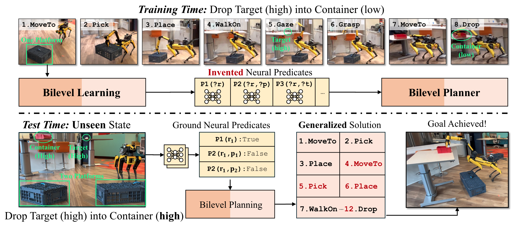

# Bilevel Learning for Bilevel Planning

Bowen Li, Tom Silver, Sebastian Scherer, and Alex Gray

Published in **Robotics: Science and Systems 2025**.



## Abstract
A robot that learns from demonstrations should not just imitate what it sees---it should understand the high-level concepts that are being demonstrated and generalize them to new tasks.
Bilevel planning is a hierarchical model-based approach where predicates (relational state abstractions) can be leveraged to achieve compositional generalization.
However, previous bilevel planning approaches depend on predicates that are either hand-engineered or restricted to very simple forms, limiting their scalability to sophisticated, high-dimensional state spaces.
To address this limitation, we present IVNTR, the first bilevel planning approach capable of learning neural predicates directly from demonstrations.
Our key innovation is a neuro-symbolic bilevel learning framework that mirrors the structure of bilevel planning.
In IVNTR, symbolic learning of the predicate "effects" and neural learning of the predicate "classifiers" alternate, with each providing guidance for the other.
We evaluate IVNTR in six diverse robot planning domains, demonstrating its effectiveness in abstracting various continuous and high-dimensional states.
While most existing approaches struggle to generalize (with $<35\%$ success rate), our IVNTR achieves an average success rate of $77\%$ on unseen tasks.
Additionally, we showcase IVNTR on a mobile manipulator, where it learns to perform real-world mobile manipulation tasks and generalizes to unseen test scenarios that feature new objects, new states, and longer task horizons.
Our findings underscore the promise of learning and planning with abstractions as a path towards high-level generalization.

## Installation
This repo is heavily based on [predicators](https://github.com/Learning-and-Intelligent-Systems/predicators), so similar installation would apply here.

- From scratch
    ```
    git clone https://github.com/Jaraxxus-Me/IVNTR.git
    conda create -n ivntr python=3.8.10
    cd IVNTR
    pip install -e .
    # We have used torch 2.1.2 on CUDA 12.1 machine, but this should be flexible
    # On a machine with CUDA and GPU
    pip install torch==2.1.2 torchvision==0.16.2 torchaudio==2.1.2 --index-url https://download.pytorch.org/whl/cu121
    # On machines without CUDA GPU (e.g., MacBook)
    pip install torch==2.1.2 torchvision==0.16.2 torchaudio==2.1.2
    # install and build FastDownward
    mkdir ext
    cd ext/
    git clone https://github.com/aibasel/downward.git
    cd downward
    python build.py
    cd ..
    cd ..
    mkdir saved_approaches saved_datasets logs
    ```
    If you want to run the blocks point cloud environment, follow instructions here to compile pytorch3d on your machine.
    Otherwise, simply use pip install
    ```
    pip install pytorch3d
    ```

    *Trouble Shooting for MacBook*:
    1. Make sure you have installed `coreutils`
        ```
        brew install coreutils
        ```


- Using docker (not verified)
    ```
    docker pull bowenli1024/predicators:v0
    ```

## Test Invented Predicates

This is used to test the installation is successful and to reproduce the Satellites Domain in Table I of our paper.

1. Download the pre-trained models [here](https://drive.google.com/file/d/1hOb776_weRpD6wkS5mBnGmkPLwrEXGku/view?usp=sharing), extract them in `IVNTR/saved_approaches`. Download all of our experiment log files [here](https://drive.google.com/file/d/1rZJZE3sQvucGBK7TUdSgmkYvP7fLooro/view?usp=drive_link) (If you want to see the settings and configurations in other domains).
    ```
    IVNTR/
    ├── saved_approaches/
    │   ├── open_models/
    │   │   ├── satellites/
    │   │   │   ├── ivntr_0/
    │   │   ├── view_plan_hard/
    │   │   ├── ...
    ```
2. Understand the mapping of the env names `->` those in the paper, Table I:
    ```
    satellites -> Satellites
    blocks_pos -> Blocks
    view_plan_trivial -> Measure-Mul
    view_plan_hard -> Climb-Measure
    pickplace_stair -> Climb-Transport
    blocks_pcd -> Engrave
    ```
3. Select a test script in `scripts/test` to plan with the invented (and selected) neural predicates.

    For example, testing the satellites domain:
    ```
    mkdir logs/satellites
    bash scripts/test/satellites/satellites_ivntr.sh # this uses cpu as device, --device "cuda:0" will use cuda gpu.
    ```
    You will notice that the script will automatically create training demonstrations and test tasks in `saved_datasets`.
    This may take a while.
    You should expect outputs like this (also see our log files `final/satellites/sim/ivntr_ood_0.log`):
    ```
    ...
    Task 50 / 50: SOLVED
    Tasks solved: 47 / 50
    Average time for successes: 0.56207 seconds
    PER_TASK_task0_options_executed: 17.0
    PER_TASK_task1_options_executed: 18.0
    PER_TASK_task2_options_executed: 15.0
    PER_TASK_task3_options_executed: 14.0
    PER_TASK_task4_options_executed: 14.0
    PER_TASK_task5_options_executed: 20.0
    PER_TASK_task6_options_executed: 18.0
    PER_TASK_task7_options_executed: 17.0
    PER_TASK_task9_options_executed: 17.0
    PER_TASK_task10_options_executed: 16.0
    PER_TASK_task11_options_executed: 13.0
    PER_TASK_task12_options_executed: 12.0
    PER_TASK_task13_options_executed: 13.0
    PER_TASK_task14_options_executed: 22.0
    ...
    ```

4. Other baselines in TABLE I

    You can also play with other baselines by following the `.sh` files in `scripts/test/satellites`. But they will need to be re-trained. Since we use the same samplers as our bilevel planner, you will need to first re-learn IVNTR following the next section.

## Documentation and Tutorials

Bilevel planning and learning predicates can be very complicated, we have tried to provide an easy-to-understand tutorial in `docs`, follow them steps by step will help you understand how bilevel learning works for bilevel planning.


## Reference
If you used our work in your research, or you find our work useful, please cite us as:
```
@INPROCEEDINGS{Li2025IVNTR,     
  title={{Bilevel Learning for Bilevel Planning}},
  author={Li, Bowen and Silver, Tom and Scherer, Sebastian and Gray, Alexander}, 
  booktitle={Proceedings of the Robotics: Science and Systems (RSS)}, 
  year={2025},
  volume={},
  number={}
}
```
